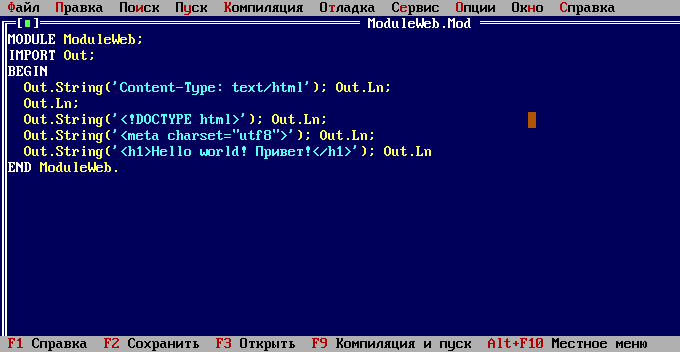

How to write a simple web site in Oberon.

# Setting up Apache2 + CGI + Free Oberon

1. Place the file `ModuleWeb.Mod` in the subdirectory `Programs`
   inside the [Free Oberon](https://free.oberon.org) directory
   and compile it. The executable file will appear in directory
   `FreeOberon/bin`. Rename it to `index.exe`, or just leave it
   as it is, if in step 3 you are going to create a symbolic link.
2. Create `/var/www/moduleweb`.
3. Put executable file `index.exe` there
   or create a symbolic link:
   `ln -s ~/FreeOberon/bin/ModuleWeb /var/www/moduleweb/index.exe`
4. Set correct access to files and directories.
5. In `/etc/hosts` write `127.0.0.1 moduleweb.cccp`.
6. Switch on the modules Apache2: `a2enmod rewrite`, `a2enmod cgi`.
7. Create `/etc/apache2/sites-available/moduleweb.conf`
   (see the contents in a separate file).
8. Enable the site: `a2ensite moduleweb` and restart Apache.
9. Open in a browser http://moduleweb.cccp

=======

Как написать простой сайт на Обероне.

# Настройка Apache2 + CGI + Free Oberon

1. Поместить файл `ModuleWeb.Mod` в подкаталог `Programs`
   внутри каталога [Free Oberon](https://free.oberon.org),
   скомпилировать его. Исполнимый файл появится в
   каталоге `FreeOberon/bin`. Его надо переименовать
   в `index.exe` или оставить как есть, если на шаге 3
   Вы собираетесь создавать символическую ссылку.
2. Создать `/var/www/moduleweb`.
3. Поместить туда исполнимый файл `index.exe`
   или создать символическую ссылку:
   `ln -s ~/FreeOberon/bin/ModuleWeb /var/www/moduleweb/index.exe`
4. Установить правильные доступы к файлам и каталогам.
   Обычно это пользователь и группа `www-data` или `www`.
5. В `/etc/hosts` прописать `127.0.0.1 moduleweb.cccp`
6. Включить модули Apache2: `a2enmod rewrite`, `a2enmod cgi`
7. Создать `/etc/apache2/sites-available/moduleweb.conf`
   (см. содержимое в отдельном файле).
8. Включить сайт: `a2ensite moduleweb` и перезагрузить Apache.
9. Открыть в обозревателе http://moduleweb.cccp
